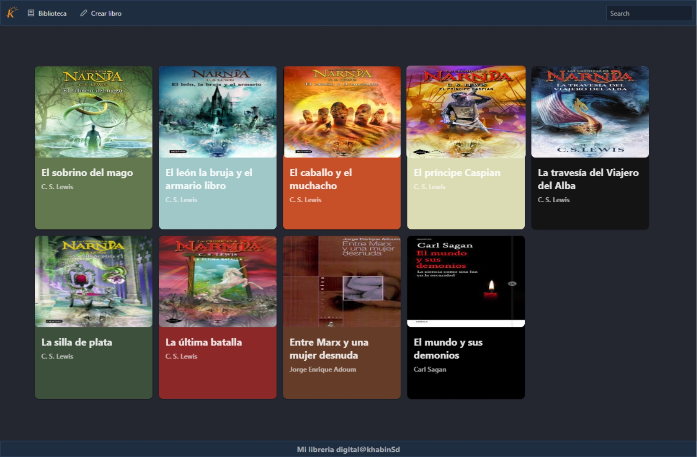

# LibraryApp
> Proyecto de la serie de videos para comprender hooks de react en este caso para practicar el useContext() useProvider() useReducer() useRef() useEffect() useState()

## Built with 

- JavaScript
- React.JS 18
- Netlify
- HTML + CSS
- Material UI
- Prominent
- Formik

## Live demo

[Live demo link](https://weather-app-km.vercel.app/)

## Run it locally

 ### Setup

 - Clone this repo using `git clone https://github.com/khabLexander/library-app`

 ### Comands
 
 - Open source folder and execute  `npm i` o `npm install`
 - When the installation is completed to install dev dependencies execute the next comand `npm start`
 - If port is avaliable the Server will start on port 3000
 - [Local attempt](localhost:3000)

## 👤 Author

 **Kevin Alexander Mantilla G**

- GitHub: [@khabLexander](https://github.com/khabLexander)
- Twitter: [@Khabin14](https://twitter.com/Khabin14)
- LinkedIn: [Kevin Alexander Mantilla](https://www.linkedin.com/in/kevin-alexander-mantilla-3238a5213/)

## 🤝 Contributing

- **Juan Sebastian Sotomayor**

- [Vida MRR Programación web](https://www.youtube.com/watch?v=oT-feDPuJmk&t=5148s&ab_channel=VidaMRR-Programacionweb/)

## 🤲 Show your support

- Give me a ⭐ if you like it!